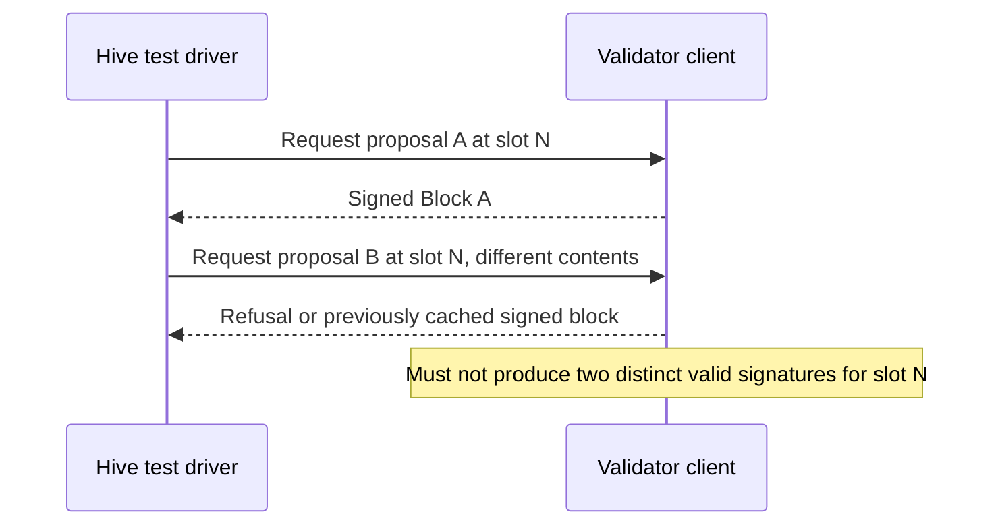

# Ream: Black-Box Interop Testing

## Tagline

Testing the failure boundaries of Lean Consensus.

## Motivation

The Lean Consensus redesign is moving from BLS to leanXMSS because BLS can be broken by a powerful enough quantum computer. BLS keys are stateless, but XMSS keys are **stateful**: each key is synchronized to signing slots and a secret key must never sign two different messages for the same slot.

A similar category of failure can be seen in Ethereum through **slashing**: a validator signing two different blocks at the same slot is a safety violation for which the protocol punishes it. XMSS could introduce a new *way* to cause that same failure in the form of a client bug in how it manages signer state. For example, a crash happening mid-write could restore stale state or two instances of the same validator could sign from the same starting point.

Currently, no tests exist in `ethereum/hive` that exercise these signer-side XMSS lifecycle failures. These types of client bugs may otherwise surface only on a real devnet or later. The team's current approach is to run devnets with **Leanstart**, find real issues, and turn them into permanent Hive regression tests.

## Project description

**Core deliverable:** two new black-box tests in `ethereum/hive`'s Lean simulator that catch the XMSS signer-state failure class described above, along with a small set of validation-suite additions.

**Secondary deliverable:** a cross-client signature-aggregation interoperability test, if the required proof-generation and verification interfaces are available.

**Stretch goals:** state-transition cross-checks, checkpoint tests and new leanSpec fixture families. These are all real gaps but as per mentor guidance they are at lower priority right now.

## Specification

### Core: XMSS statefulness

A block's signature is cryptographically bound to it's exact block root and slot. However, two different, correctly signed blocks from the same proposer at the same slot are both valid from the receiver's perspective. LeanSpec accepts and stores both blocks, while fork choice selects one canonical head.

Therefore, this test must target the validator's signing boundary.

| Test | What it proves | How |
|---|---|---|
| **Proposal-leaf non-reuse** | A validator client should  never produce two distinct valid proposal signatures with the same key and slot | Test will trigger repeated or concurrent proposal attempts at slot N with different contents and will assert that at most one distinct block is signed |
| **Key exhaustion** | A client stops signing cleanly once a key's validity window ends instead of  crashing or any misbehaviour | A  purpose-built key will be used with a short known window which will advance past the end and confirm that  a bounded clean refusal is done |

An acceptable client may refuse the second signing request, return the previously cached signed block, or report that the slot has already been consumed. The essential invariant is that it must not produce two different valid proposal signatures for the same key and slot.

**Build requirement:** `simulators/lean/src/utils/libp2p_mock.rs` can publish blocks to a client but as of now, peer-injected blocks do not exercise the client's own signer. A small Hive test-driver hook or client adapter is therefore needed to request a proposal and observe the signed output.

### Validation tests (Quick Win)

A set of three live integration tests:

1. reject a block beyond the allowed future-slot horizon.
2. accept a valid block after rejecting an invalid block for testing resilience.
3. process duplicate delivery of the same valid block idempotently by making sure a client doesn't import it twice or enter a bad state.

LeanSpec already has reference coverage for future-slot and duplicate-block behavior. These Hive additions are intended to exercise the live gossip and client-integration path rather than introducing new consensus rules.

### Signature aggregation

A cross-client aggregate-verification test at the proof level: a proof produced by Client A's leanMultisig implementation is verified by Client B's verification code.

Hive already runs common signature-verification fixtures against clients, so the new value here is the direct handoff of proof material generated by one implementation to another. This work is gated on clients exposing compatible proof-generation and verification interfaces.

### Stretch goals (Priority order)

1. **Checkpoint root/slot mismatch test** :  a peer provides a checkpoint metadata whose declared root does not match the block at that slot. Before implementing it, I will audit the existing Hive bad-checkpoint scenarios and LeanSpec checkpoint fixtures to ensure the test covers a real remaining gap.
2. **State-transition cross-check** : compare the state roots across clients at same finalized checkpoint. This can use the existing finalized-state endpoints where supported. A new endpoint will be  needed only if the comparison is expanded to live head state.
3. **Spec tests** : add new leanSpec fixture families for genesis, shuffling, and operations.

## Roadmap

| Weeks | Focus | Deliverable |
|---|---|---|
| 1–2 | Run Leanstart devnet cycles to look for real failures and land the validation PR | PR merged; devnet findings notes |
| 3–4 | Study the existing signing paths to define the signer test-driver interface and prepare short-window test keys | Signer test interface and reusable test assets |
| 5–7 | Build and land the proposal-leaf non-reuse test | Repeated-signing test merged  |
| 8–9 | Build the key-exhaustion test  | Core XMSS lifecycle tests merged  |
| 10–11 | Audit signature-aggregation interfaces and implement the cross-client proof test if feasible | Merged test or documented go/no-go result |
| 12–13 | Implement the highest-priority feasible checkpoint or finalized-state cross-check | Stretch test merged or scoped design |
| 14–16 | Remaining stretch work review fixes along with final report and presentation | Stretch work merged or designed &  final report published |

## Possible challenges

- Lstar and leanSpec are still evolving, so fixture formats or signature interfaces could shift during the fellowship. The test-driver and proof-handling code should therefore remain modular.
- Hive currently exercises clients mainly through networking and helper APIs so testing signer state requires a narrow test-driver hook or adapter.
- The cross-client aggregate test depends on proof-generation and verification interfaces. If they are not available, I will ship the interface analysis and design instead of forcing client-specific code.
- Failures discovered while running Leanstart devnets may affect the ordering of stretch work, so the project will keep the core XMSS tests fixed while allowing lower-priority work to change.

## Goal of the project

**Minimum success:**

- A reusable Hive test-driver path for exercising proposal signing
- Proposal-leaf non-reuse and key-exhaustion tests merged
- The validation-resilience tests merged 
- Reproduction instructions and results documented

**Strong success:**

- XMSS lifecycle tests run against at least two independent client implementations
- A repeated-signing variant plus a concurrent or restart-related variant
- Cross-client signature-aggregation verification implemented or the checkpoint mismatch test merged

**Stretch success:**

- Finalized state-transition roots compared successfully across clients
- A new leanSpec fixture family supported through Hive
- New issues experienced while running devnets reproduced as permanent Hive regression tests

## Collaborators

### Fellow

Mohit Grover

### Mentors

Kolby Moroz Liebl (KolbyML), Derek Sorken

## Resources

- Lean simulator: https://github.com/ethereum/hive/tree/master/simulators/lean
- Ream client: https://github.com/ReamLabs/ream
- leanSpec: https://github.com/leanEthereum/leanSpec
- leanSig: https://github.com/leanEthereum/leanSig
- leansig-test-keys: https://github.com/leanEthereum/leansig-test-keys
- leanMultisig: https://github.com/leanEthereum/leanMultisig
- Leanstart (devnet runner): https://github.com/ReamLabs/leanstart
- Roadmap: https://leanroadmap.org
- Live test dashboard: https://hive.leanroadmap.org
- LeanSpec equivocation behavior: https://github.com/leanEthereum/leanSpec/blob/main/tests/consensus/lstar/fork_choice/test_equivocation.py
- Merged PR: https://github.com/ethereum/hive/pull/1573
