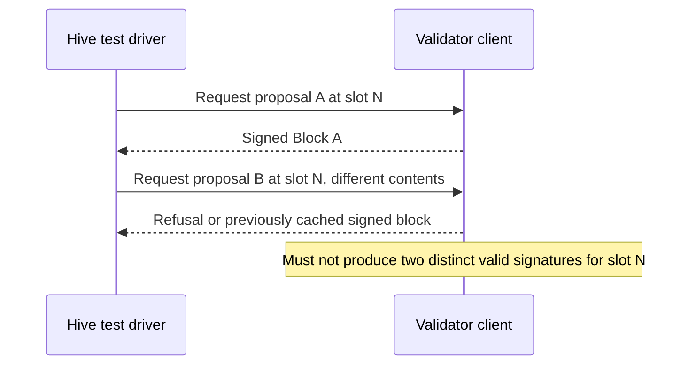

# Ream: Black-Box Interop Testing

## Tagline

Testing XMSS signer-state failure modes in Lean Consensus.

## Motivation

The Lean Consensus redesign is moving from BLS to leanXMSS because BLS can be broken by a powerful enough quantum computer. BLS keys are stateless, but XMSS keys are **stateful**: each key is synchronized to signing slots and a secret key must never sign two different messages for the same slot.

A similar category of failure can be seen in Ethereum through **slashing**: a validator signing two different blocks at the same slot is a safety violation for which the protocol punishes it. XMSS could introduce a new *way* to cause that same failure in the form of a client bug in how it manages signer state. For example, a crash happening mid-write could restore stale state or two instances of the same validator could sign from the same starting point.

Currently, no tests exist in `ethereum/hive` that exercise these signer-side XMSS lifecycle failures. These types of client bugs may otherwise surface only on a real devnet or later. The team's current approach is to run devnets with **Leanstart**, find real issues, and turn them into permanent Hive regression tests.

## Project description

**Core deliverable:** two new black-box tests in `ethereum/hive`'s Lean simulator that catch the XMSS signer-state failure class described above, along with a small set of validation-suite additions.

**Secondary deliverable:** a cross-client signature-aggregation interoperability test, for which Hive already provides a verification path through `/lean/v0/test_driver/verify_signatures/run` but it doesn't define a common way for Client A to generate and export aggregate proof material for Client B. I will audit the participating clients and define the smallest common generation and verification contract.

**Stretch goals:** a finalized-state cross-check between clients at the same finalized checkpoint.

## Specification

### Core: XMSS statefulness

A block's signature is cryptographically bound to it's exact block root and slot. However, two different, correctly signed blocks from the same proposer at the same slot are both valid from the receiver's perspective. LeanSpec accepts and stores both blocks, while fork choice selects one canonical head.

Therefore, this test must target the validator's signing boundary.

| Test | What it proves | How |
|---|---|---|
| **Proposal-leaf non-reuse** | A validator client should  never produce two distinct valid proposal signatures with the same key and slot | Test will trigger repeated or concurrent proposal attempts at slot N with different contents and will assert that at most one distinct block is signed |
| **Key exhaustion** | A client stops signing cleanly once a key's validity window ends instead of  crashing or any misbehaviour | A cleint starts from pre-computed near exhaustion checkpoint which will then advance past the end and confirm that  a bounded clean refusal is done |

An acceptable client may refuse the second signing request, return the previously cached signed block, or report that the slot has already been consumed. The essential invariant is that it must not produce two different valid proposal signatures for the same key and slot.

### Signer test-driver dependency

`simulators/lean/src/utils/libp2p_mock.rs` can publish blocks to a client, but peer-injected blocks do not exercise the client's own signer. So, XMSS tests need a narrow test-driver hook or client adapter that lets Hive request a proposal and observe the signed result.

The minimum contract would need to carry:

- the validator index and signing slot;
- the block contents or block root to be signed;
- either the resulting signed block/proof or a structured refusal; 
- enough error information to distinguish a consumed slot, an inactive key, an unsupported operation and an internal failure.

The contract will be enabled only in Hive test-driver mode. I will map where the existing clients implement `/test_driver/*`, compare an in-client endpoint with a Hive-side adapter and agree on the request/response schema with Richard, mentors, and client teams. The first implementation will target the LeanSpec reference adapter and one independent client.

The exhaustion test has one additional dependency: existing production-like test keys have active ranges that are too long to exhaust during a Hive run. The test therefore needs isolated short-window keys or a test-only key configuration. These assets will be created alongside the signer driver.

A set of three live integration tests:

1. reject a block beyond the allowed future-slot horizon.
2. accept a valid block after rejecting an invalid block for testing resilience.
3. process duplicate delivery of the same valid block idempotently by making sure a client doesn't import it twice or enter a bad state.

LeanSpec already has reference coverage for future-slot and duplicate-block behavior. These Hive additions are intended to exercise the live gossip and client-integration path rather than introducing new consensus rules.

### Signature aggregation

This test would  perform a direct cross-client handoff where Client A generates an aggregate proof for known messages, slots  and Client B verifies that exact proof.

The initial audit is about finding answers to these questions:

1. which clients can generate and export the aggregate proof;
2. whether the existing verification-fixture input can carry Client A's output unchanged; 
3. whether two clients can implement the same test-only contract.

This produces an explicit go/no-go result in the first few weeks.

### Stretch goals 

**Finalized State Comparison** : A test where  two clients start from the same genesis and wait until they report the same finalized checkpoint, then  retrieve the finalized state from each client andcompare the resulting state roots. If the core work finishes early, the next step would be to audit checkpoint coverage and design a common head-state response.

## Collaboration with Richard Gregory

Richard's project audits LeanSpec fixtures and widens Hive's test-driver response schema so that pinned fields are no longer silently dropped. My XMSS tests require a new signer-facing test-driver operation. The projects do not implement the same tests, but they depend on consistent test-driver conventions and coordinated client adoption.

Our concrete split is:

- **Weeks 1–2:** jointly inventory the existing `/test_driver/*` implementations and write one short schema document covering naming, request/response envelopes, optional-field rollout, structured errors, and versioning.
- **End of Week 2 handoff:** I provide the signer-operation requirements and aggregate-proof feasibility findings. Richard uses the agreed conventions for `StateTransitionPost` and fork-choice response widening.
- **Implementation ownership:** I own the signer hook/adapter, XMSS assets, and XMSS Hive scenarios. Richard owns the fixture audit, state-transition response expansion, and assertion enforcement in `spec_assets.rs`.
- **Client coordination:** we circulate one combined contract request to client teams and split client-side PRs between us, avoiding separate and potentially conflicting test-driver changes.
- **Ongoing integration:** each of us tests the other's schema changes against our consumer code so the shared contract remains backwards compatible.

## Roadmap

| Weeks | Focus | Deliverable |
|---|---|---|
| 1–2 | Audit signer and aggregate-proof interfaces; co-design the test-driver schema with Richard; run Leanstart and continue validation work | Shared schema document; signer-interface plan; aggregation go/no-go; explicit handoff to Richard |
| 3–4 | Study the existing signing paths to define the signer test-driver interface and prepare short-window test keys | Signer test interface and reusable test assets |
| 5–7 | Build and land the proposal-leaf non-reuse test | Repeated-signing test merged  |
| 8–9 | Build the key-exhaustion test  | Core XMSS lifecycle tests merged  |
| 10–11 | Implement cross-client aggregate handoff only if the Week 2 gate passed | Aggregate test or completed interface design |
| 12 | Core integration and client-matrix hardening | Core tests stable across the supported client set |
| 13–14 | Implement the finalized-state cross-check if the core completion gate is met | Cross-client comparison against a matched finalized checkpoint |
| 15–16 | Review fixes, documentation, final report, and presentation | Merged PRs; reproduction instructions; final report |

## Possible challenges

- Clients do not currently expose one common proposal-signing operation and it would require Multi Client coordination.
- Lstar and leanSpec are still evolving, so fixture formats or signature interfaces could shift during the fellowship. The test-driver and proof-handling code should therefore remain modular.
- Hive currently exercises clients mainly through networking and helper APIs so testing signer state requires a narrow test-driver hook or adapter.
- The cross-client aggregate test depends on proof-generation and verification interfaces. If they are not available, I will ship the interface analysis and design instead of forcing client-specific code.
- Failures discovered while running Leanstart devnets may affect the ordering of stretch work, so the project will keep the core XMSS tests fixed while allowing lower-priority work to change.

## Goal of the project

**Minimum success:**

- Shared test-driver schema completed and handed off to Richard by the end of Week 2
- A reusable Hive test-driver path for exercising proposal signing
- Proposal-leaf non-reuse and key-exhaustion tests merged
- The validation-resilience tests merged 
- Reproduction instructions and results documented

**Strong success:**

- XMSS lifecycle tests run against at least two independent client implementations
- A repeated-signing variant plus a concurrent or restart-related variant
- Cross-client aggregate-proof handoff implemented if the Week 2 feasibility gate passes

**Stretch success:**

- Finalized state roots compared successfully between at least two clients at the same finalized checkpoint

## Collaborators

### Fellow

Mohit Grover

### Collaboration

Richard Gregory: co-design of the Hive test-driver contract, coordinated client adoption, and cross-testing of the shared schema.

### Mentors

Kolby Moroz Liebl (KolbyML), Derek Sorken

## Resources

- Lean simulator: https://github.com/ethereum/hive/tree/master/simulators/lean
- Ream client: https://github.com/ReamLabs/ream
- leanSpec: https://github.com/leanEthereum/leanSpec
- leanSig: https://github.com/leanEthereum/leanSig
- leansig-test-keys: https://github.com/leanEthereum/leansig-test-keys
- leanMultisig: https://github.com/leanEthereum/leanMultisig
- Leanstart (devnet runner): https://github.com/ReamLabs/leanstart
- Roadmap: https://leanroadmap.org
- Live test dashboard: https://hive.leanroadmap.org
- LeanSpec equivocation behavior: https://github.com/leanEthereum/leanSpec/blob/main/tests/consensus/lstar/fork_choice/test_equivocation.py
- Merged PR: https://github.com/ethereum/hive/pull/1573
