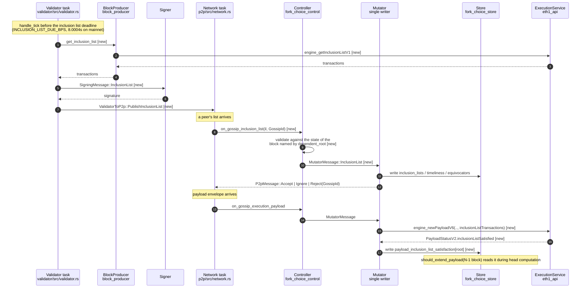

# FOCIL in Grandine

Implement EIP-7805 in Grandine. A Grandine node will publish a signed inclusion list when one of its validators is drawn onto the slot's committee, track the lists its peers publish, build payloads and bids that honour them, and refuse to extend a payload that does not. Post-EPF stretch work focuses on devnet interop with other clients and the edge cases that surface there.

---

## Motivation

Block production on Ethereum is concentrated in a small number of specialized builders. A builder can decline to include a transaction directly, or the relay carrying its blocks can refuse to propagate any block containing one. Validators attest to and finalize those blocks but have negligible protocol-level means to require that a given transaction be carried, so censorship resistance rests on the assumption that some non-censoring builder eventually picks up what the others drop. OFAC's sanctioning of Tornado Cash in August 2022 tested that assumption: relay operators including Flashbots began refusing any block containing a transaction that touched a listed address, and because those relays carried most of the network's blocks, OFAC-compliant blocks reached 79% of the chain by November. Affected transactions were still included, just later.

FOCIL ships in Heze, layered on the ePBS changes from Gloas ([EIP-7732](https://eips.ethereum.org/EIPS/eip-7732)), which remove the relay from the protocol path but leave the builder's discretion over payload contents intact. Glamsterdam is reaching public testnets now and targets mainnet around September 2026, so Grandine's Gloas base is stable for most of the fellowship. Heze development follows, and Grandine team involvement in it scales up once Gloas has shipped. The aim is to have an interoperable FOCIL implementation ready by that point, testable against Lighthouse, Lodestar and Prysm, which carry FOCIL at varying degrees of completeness. Once Glamsterdam is out, the later phases shift to working with the Grandine team on advancing Heze devnets and keeping the FOCIL code in step with the newer EIPs that land in Heze alongside it.

## Project description

FOCIL support will be implemented in Grandine across seven areas, following the structure of the Heze spec. Each is detailed under Specification.

1. **Types and constants.** The `InclusionList` and `SignedInclusionList` containers, `inclusion_list_bits` on `ExecutionPayloadBid`, and the new presets, constants and config values.
2. **Consensus helpers.** IL-committee derivation, dependent-root resolution and validation, signature verification, and committee-assignment lookahead.
3. **Inclusion list store.** The store shared by gossip validation, block production, fork-choice enforcement and req/resp serving, including equivocation tracking and the timely/full view split.
4. **Networking.** The `inclusion_list` gossip topic and its validation rules, the bid-bits check on `execution_payload_bid` gossip, the `InclusionListsByIndices` request/response protocol, and IL backfill.
5. **Fork choice.** Per-payload satisfaction recorded at envelope reveal, and the `should_extend_payload` gate that refuses to extend unsatisfied payloads.
6. **Block and bid production.** Self-building IL-satisfying payloads, setting `inclusion_list_bits` on outgoing bids, and rejecting incoming bids whose bits fall short of the node's view.
7. **Validator duties.** IL-committee membership tracking, dependent-root selection, signing, and publication before the timeliness cutoff.

The following diagram maps a general view of Grandine component interactions with the FOCIL flow. New FOCIL messages and types are marked `[new]`. Everything else already exists till Gloas.

Producing and publishing an inclusion list never leaves the process for Grandine's integrated validator, so there is no beacon-node to validator-client round trip on that path; external validator clients still go through the Beacon API.

Cross-client testing is likely as much work as the implementation. Spec tests can pass while the real effort is debugging issues that only surface in interop. Interop itself escalates in stages: first self-built payloads, then payloads from other builders and validators.

Specifications followed:

- [Consensus spec, Heze](https://github.com/ethereum/consensus-specs/tree/master/specs/heze)
- [Engine API, merged as bogota.md](https://github.com/ethereum/execution-apis/blob/main/src/engine/bogota.md)
- [Beacon API, PR #490](https://github.com/ethereum/beacon-APIs/pull/490)

## Specification

### Types and constants

Grandine's `types` crate gains preset-generic `InclusionList` and `SignedInclusionList` containers, while `ExecutionPayloadBid` gains `inclusion_list_bits`. Because the latest bid is part of `BeaconState`, the latter also changes the Heze state root.

The list carries a `dependent_root` rather than a committee root after [consensus-specs PR #5513](https://github.com/ethereum/consensus-specs/pull/5513). A receiver resolves that block, advances its state to the list's slot and derives the committee. The resulting committee root becomes the store key. This lets lists from competing branches be checked against the state they actually reference.

The new preset, domain, configuration values and p2p bounds will be placed in Grandine's corresponding spec classes. `upgrade_to_heze` and the combined fork transition apply the state-layout change.

### Consensus helpers

Grandine can build the IL committee on its existing beacon-committee logic. `get_inclusion_list_committee(state, slot)` concatenates the slot's committees and wraps when fewer than `INCLUSION_LIST_COMMITTEE_SIZE` validators are available.

Producers use `get_shuffling_dependent_root` to choose the state their list refers to. Receivers check it with `is_valid_dependent_root`. `is_valid_inclusion_list_signature` uses the list's slot epoch for its signing domain. Duty lookahead computes next-epoch assignments at the epoch boundary and serves only current- or next-epoch queries.

### Inclusion list store

The store connects gossip validation, payload construction, bid checks, fork choice and req/resp. It is indexed by slot and derived committee root and stores the complete `SignedInclusionList`, making later `InclusionListsByIndices` responses possible without separate signature storage.

`process_inclusion_list` keeps a validator's first list. If the same validator later sends a different one, it is marked as an equivocator and neither contribution is used. The remaining read methods expose the required transactions, the committee bits observed by the node, and whether a bid covers those bits.

Accepted lists are tagged as timely or late rather than discarding late arrivals. Gossip and fork-choice enforcement use only the timely view. Payload building, bid construction, equivocation detection and req/resp use the full view. Lists remain available through the inclusive `MIN_SLOTS_FOR_INCLUSION_LISTS_REQUESTS` window so they are not pruned before the next proposer or req/resp server uses them.

The consensus spec models this separately from fork choice, but validation also needs `Store.block_states`. Grandine may therefore keep the inclusion-list store inside `fork_choice_store::Store`. Its final placement and read consistency will be decided with maintainers during Phase 2.

### Networking

Grandine's p2p layer gains `PubsubMessage::InclusionList`, a matching `GossipKind`, an `eth2_libp2p` topic and Heze-specific size bounds. Validation rejects oversized messages first, then checks the slot and duplicates before resolving the dependent block and verifying committee membership and signature. The integrated validator publishes through `ValidatorToP2p`.

`InclusionListsByIndices` requests a slot, dependent root and bitvector of committee indices, returning the matching signed lists within the configured retention range.

### Engine API

The three execution-layer changes are already merged in `execution-apis` ([PR #609](https://github.com/ethereum/execution-apis/pull/609)). Grandine exposes `engine_getInclusionListV1` through `ExecutionEngine` and `eth1_api` to obtain bounded, non-blob candidate transactions from the mempool. The payload-building path carries the node's inclusion-list transactions in `PayloadAttributesV5` through `engine_forkchoiceUpdatedV5`.

For payload validation, `engine_newPayloadV6` receives the timely previous-slot transactions and returns `PayloadStatusV2.inclusionListSatisfied`. `ExecutionPayloadParams` therefore gains a Heze variant containing the existing payload context plus these transactions.

### Fork choice

At envelope reveal, Grandine records whether the payload satisfied the previous slot's timely lists. An optimistic payload starts as satisfied so it can continue through fork choice, but a later `VALID` response can replace that value with the execution layer's actual verdict. Transactions for an `ACCEPTED` payload remain available while it is still a branch tip so the check can be completed later.

The result fits Grandine's existing per-block payload data: a `payload_inclusion_list_satisfaction: HashMap<H256, bool>` is keyed by block root alongside `payloads` and the payload vote maps. `should_extend_payload` reads it after the existing payload-verification guard and stops on a known-unsatisfied payload.

### Block and bid production

The timely/full split is not uniform across call sites.

| Call site | View |
| --- | --- |
| Self-build payload | `only_timely = false` |
| Self-bid bits | `only_timely = false` |
| Proposer's incoming-bid selection | `only_timely = false` |
| Bid gossip validation | `only_timely = true` |
| Fork-choice payload enforcement | `only_timely = true` |

Using the full previous-slot view, pass IL transactions through `PayloadAttributesV5`, set the self-bid's `inclusion_list_bits`, and accept only incoming bids whose bits cover every inclusion list observed by the proposer.

### Validator duties

- Track IL-committee membership, fetch transactions, assemble the list, sign under `DOMAIN_INCLUSION_LIST_COMMITTEE`, and publish before the cutoff. Assembling a list also means choosing the dependent root for the head the validator is building on.
- The deadline does not fall on Grandine's tick grid. Post-Gloas, Grandine divides the slot into sixteen uniform ticks of 0.75 seconds. `INCLUSION_LIST_DUE_BPS = 6667` places the mainnet cutoff at 8.0004 seconds; the 7.5-second tick precedes it by roughly 500 ms and the 8.25-second tick is too late. This would require some change after some discussion.

## Roadmap

**Phase 1 - Types and helpers (2 weeks, 1 - 14 August)**

- Add the Heze data model, fork transition, consensus helpers and spec-test support.

**Phase 2 - Store and gossip (15 August - 24 September)**

- Implement inclusion-list storage and the complete gossip validation and propagation path.
- Cover equivocation handling and timely/full views with tests.

**Phase 3 - Req/resp (25 September - 4 October)**

- Add inclusion-list serving and client-side gap filling.

**Phase 4 - Duties, publication and APIs (5 - 24 October)**

- Implement validator duties, signing, publication, Beacon API and Engine API integration.

**Phase 5 - Fork-choice enforcement and production (25 October - 14 November)**

- Complete fork-choice enforcement, payload and bid production, bid checks and integration tests.

**Post-EPF stretch - Interop and hardening**

- Run Grandine and cross-client devnets, then address interop failures, metrics and spec changes.

## Possible challenges / Note

- **Spec movement during implementation.** FOCIL is still changing under active review. Work that depends on generated test fixtures/vectors for verification is therefore impacted by upstream releases as well, so the plan assumes a periodic spec catch-up pass matching spec releases.
- **In-process validator client.** Grandine supports validator clients but runs its own validator in the same binary, so the spec's assumptions about beacon-node to validator-client communication apply differently here than in other clients. Beacon API adaptation is still a project deliverable, since validator clients/testing(ethpandaOps) tools would likely need the FOCIL duty, produce and publish endpoints.
- **Fork-choice weight propagation.** FOCIL introduces no change to how weights propagate along the block tree. Grandine groups unfinalized blocks into per-fork segments rather than a proto-array, and as things stand that requires little deviation from the spec. If Heze does end up touching weight propagation (unlikely), adapting the segment-based structure would take ~1-2 weeks.
- **Base branch.** FOCIL depends on the progressive SSZ types introduced by [EIP-7916](https://eips.ethereum.org/EIPS/eip-7916) and [EIP-7495](https://eips.ethereum.org/EIPS/eip-7495): `InclusionList.transactions` is a `ProgressiveList`, and `ExecutionPayloadBid`, which carries `inclusion_list_bits`, is a `ProgressiveContainer`. Both are already implemented upstream on the latest Glamsterdam devnet branch, where `ssz/src/merkle_tree.rs` provides `merkleize_progressive` and `mix_in_active_fields` alongside `progressive_list.rs`. None of it is on `develop` as of now. The work therefore builds on the latest `glamsterdam-devnet-*` branch rather than `develop`, and stays rebased as those branches advance.

## Goal of the project

A Grandine node that takes part in FOCIL end to end on a Heze devnet. Concretely:

1. Committee members produce, sign and broadcast inclusion lists inside the timeliness window.
2. Nodes validate, store, propagate and serve inclusion lists per the p2p spec, including equivocation handling and dependent-root validation.
3. Fork choice declines to extend a payload the execution layer reports as unsatisfied.
4. Proposers build satisfying payloads, set their bid bits correctly, and reject censoring external bids.
5. Changes carry unit tests and metrics.
6. **Post-EPF stretch:** devnet interop with another FOCIL-capable client, demonstrating propagation and censoring-payload rejection.

## Collaborators

### Fellows

- **Subhasish Behera** ([@Subhasish-Behera](https://github.com/Subhasish-Behera))
- Possibility: coordination with the Lighthouse FOCIL fellows on cross-client behaviour and devnet interop.

### Mentors

- **Saulius Grigaitis** ([@sauliusgrigaitis](https://github.com/sauliusgrigaitis)) - Grandine.

## Resources

- [EIP-7805, Fork-choice enforced Inclusion Lists](https://eips.ethereum.org/EIPS/eip-7805)
- [FOCIL, the original research post](https://ethresear.ch/t/fork-choice-enforced-inclusion-lists-focil-a-simple-committee-based-inclusion-list-proposal/19870)
- [Heze consensus specs](https://github.com/ethereum/consensus-specs/tree/master/specs/heze)
- [consensus-specs PR #5513](https://github.com/ethereum/consensus-specs/pull/5513), `on_inclusion_list` from req/resp and the `dependent_root` change
- [Engine API, bogota.md](https://github.com/ethereum/execution-apis/blob/main/src/engine/bogota.md) and [PR #609](https://github.com/ethereum/execution-apis/pull/609)
- [Beacon API, PR #490](https://github.com/ethereum/beacon-APIs/pull/490)
- [EIP-7732, enshrined proposer-builder separation](https://eips.ethereum.org/EIPS/eip-7732)
- [ePBS and FOCIL compatibility](https://ethereum-magicians.org/t/epbs-focil-compatibility/24777)
- [EIP-7688, forward compatible consensus data structures](https://eips.ethereum.org/EIPS/eip-7688)
- [Grandine](https://github.com/grandinetech/grandine) codebase
- [FOCIL in Grandine](https://hackmd.io/jV2ugVx8TpaNcONhXXLKtg) (EPF6 haxry's proposal)
- [Lighthouse FOCIL proposal](https://github.com/eth-protocol-fellows/cohort-seven/blob/main/projects/lighthouse-focil.md) (EPF7)
