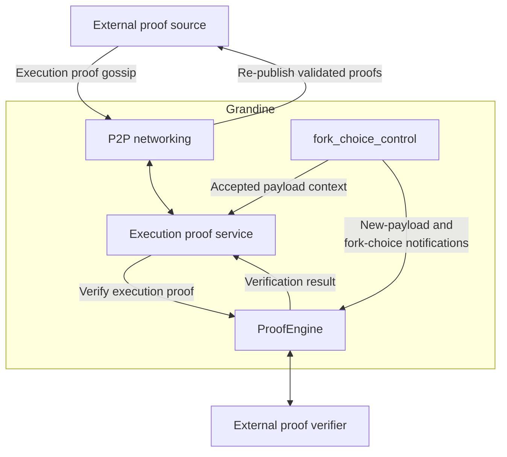
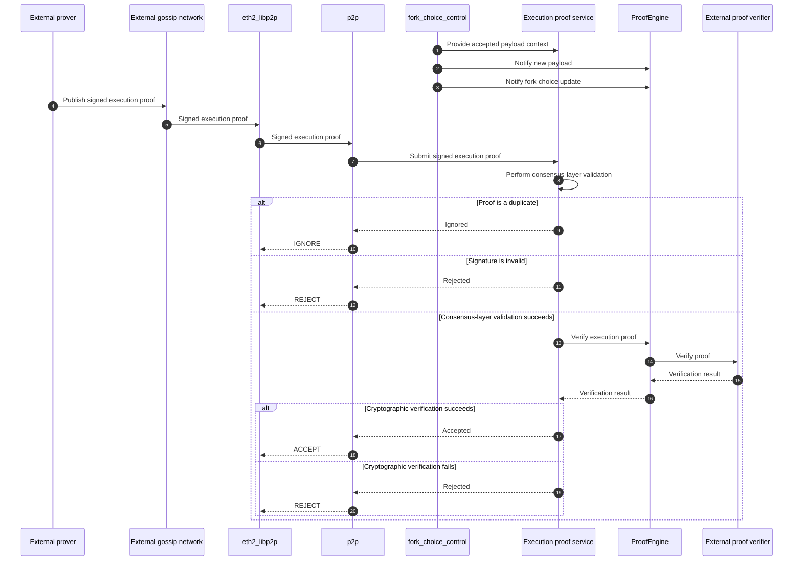

# Implementing EIP-8025 Optional Execution Proofs in Grandine

## Motivation

After more than three years without an increase, Ethereum resumed
raising its gas limit in February 2025, reaching 60 million gas and
signaling a broader shift toward scaling L1 execution. Today,
execution clients across the network independently repeat the same
computation to validate each execution payload, and the cost of this
duplicated work rises with the gas limit. The path toward gigagas
raises a fundamental question: how can Ethereum scale execution
without compromising the broad node participation that supports its
CROPS values?

Running a validator requires operating both a consensus client and an
execution client. These two services must be separately configured and
kept compatible, with coordinated upgrades during hard forks. The
execution client must also maintain the execution state required to
re-execute and validate each new payload, increasing compute and
storage requirements.

Execution proofs offer a way to support L1 scaling by replacing
re-execution with proof verification whose cost is largely independent
of the gas limit. They could allow consensus clients to validate
execution payloads—and even sync to the chain head—without relying on
a local execution client, reducing the operational burden of today's
two-client architecture. Realizing this model would require changes
primarily to the execution-payload validation path and to the
consensus-layer P2P protocols used to gossip proofs.

## Project description

Optional Execution Proofs (EIP-8025) proposes to remove the
computational burden of transaction re-execution for every client node
via a simple and lightweight execution proof. An execution proof is a
cryptographic proof that guarantees a block's associated execution
payload is valid. Under this EIP, consensus clients will be
self-sufficient to perform block validations, node syncing,
attestations and fork-choice updates using execution proofs.
Meanwhile, execution clients will take on a critical and highly
specialized role of generating execution witnesses for these execution
proofs, creating a clean separation between consensus and execution.
This independence allows consensus clients to validate the chain on
their own from proofs propagated over the consensus-layer gossip
network, and to actively gossip newly received proofs once they have
verified them to be true.

A prover generates execution proofs and shares them with peers.
Whereas, a verifier (zkAttester) verifies these proofs and attests to
slots based on the validity of the associated proof. Both provers and
verifiers must be active validators to perform their duties. To enable
network statelessness for verifiers, a prover must maintain a fully
synchronized node comprising both the execution and consensus clients,
with the execution client natively executing blocks and packaging the
accessed state and bytecode into a self-contained execution witness
used to generate the proof. Concurrently, the consensus client acts as
a cryptographic coordinator, monitoring the beacon chain to trigger
proof generation, signing the resulting proof, and broadcasting it
across the network.

At the protocol level, this EIP introduces the `ProofEngine` as a new
abstraction operating alongside the traditional `ExecutionEngine`. For
the prover, this `ProofEngine` becomes the critical interface that
initiates asynchronous proof generation, manages local proof storage,
and handles mathematical verification, perfectly synchronizing the
execution client's heavy data output with the consensus layer's
network operations.

There is a single `ExecutionProof` type and it is recursive. One proof
attests to every payload between a weak-subjectivity checkpoint and
the head. A node joining from that checkpoint therefore verifies one
proof rather than one per payload, removing the need to retrieve
historical proofs during sync. Once synced, a verifier continues to
check proofs that extend the prefix as blocks arrive. How a prover
constructs the recursive proof is opaque to the consensus layer and
out of scope here.

The zkVMs infrastructure is not yet mature enough to be standardized
and support real-time proving. Therefore, EIP-8025 is fully optional
and straightforward to implement, requiring no hard fork since it does
not alter Ethereum's core consensus.

The immediate scope of this project is for Grandine consensus client
to successfully receive, validate and retain recursive execution
proofs. As such, any execution client or Engine API integrations are
currently excluded from the core requirements and will only be
pursued as stretch goals.

This proposal targets the current draft of EIP-8025 and may require
adjustment as the specification evolves.

## Specification

### Scope and architecture

The core implementation will enable Grandine to receive, validate, and
retain recursive EIP-8025 execution proofs generated by external proof
systems. The implementation includes SSZ representation and hashing,
payload context resolution and binding validation, signature
verification, cryptographic proof verification, gossip reception,
checkpoint and verified-head anchor tracking, weak-subjectivity-to-head
sync gating, and proof state management. All proof distribution is
gossip-based; Grandine implements no proof request/response protocol.

Within this scope, execution proof handling remains auxiliary to
Grandine's existing payload validation and fork-choice behavior. Proof
verification failures do not invalidate an execution payload that has
already been accepted through the existing Engine API flow.

The following table summarizes the responsibilities of the principal
Grandine components shown in the architecture.

| Component | Responsibility |
|-|-|
| Execution proof service | Coordinates proof reception, consensus-layer validation, payload context resolution, checkpoint and verified-head anchor tracking, gossip validation outcomes, and calls to `ProofEngine` for proof verification |
| `ProofEngine` | Verifies execution proofs, maintains stored proof state, and handles new payload and fork-choice notifications for retention and pruning |
| P2P networking | Receives proofs through gossip and re-publishes proofs that pass validation |
| `fork_choice_control` | Supplies the accepted payload context to the execution proof service and sends new-payload and fork-choice notifications to `ProofEngine` |

### Data model and hashing

EIP-8025 introduces a proof type identifier and three consensus-layer
SSZ containers for representing, binding, and signing execution
proofs. Together, these types form the core execution-proof data model
used by proof generation, validation, gossip, and retained proof
state.

| Type | Purpose |
|-|-|
| `PublicInput` | Binds the proof to the new payload request being proved |
| `ProofType` | Identifies the proof system used to generate and verify the proof |
| `ExecutionProof` | Contains the recursive proof bytes, proof type, and public input |
| `SignedExecutionProof` | Wraps an `ExecutionProof` with the validator index and BLS signature required for publication and validation |

The payload binding is the SSZ hash tree root of the corresponding new
payload request. The unsigned `ExecutionProof` is signed by a prover,
who must be an active validator, producing the `SignedExecutionProof`
exchanged through gossip.

### Proof reception, validation, and retention

The following sequence diagram illustrates the gossip-validation path.
The prover's internal generation and signing steps are omitted
because they are outside the core project scope. Grandine delegates
cryptographic proof verification to an external verifier through
`ProofEngine`.

When a block arrives, the consensus client acts as a
dual-orchestrator: it notifies the `ExecutionEngine` to handle payload
verification and witness preparation, while simultaneously notifying
the `ProofEngine`.

### Required changes by functional area

The identified EIP-8025 implementation gaps cut across four functional
areas:

#### Representation and hashing
| Gap | Likely implementation area |
|-|-|
| EIP-8025 SSZ proof containers | `types` |

This area defines the EIP-8025 SSZ containers `PublicInput`,
`ExecutionProof`, and `SignedExecutionProof`. It also supports their
SSZ serialization and deserialization and the computation of their
hash-tree roots.

#### Payload context and proof engine
| Gap | Likely implementation area |
|-|-|
| Proof Engine integration | `ProofEngine` (proposed)  `fork_choice_control` |
| tracking accepted payloads and resolving proof bindings | `fork_choice_control`  new execution proof service |
| checkpoint and verified-head anchor state | `ProofEngine` (proposed)  new execution proof service |
| proof-state retention and pruning | `ProofEngine` (proposed) |

This area adds the `ProofEngine` verification and notification
interfaces, integrates proof verification with
the external verifier, connects the notification interfaces to
`fork_choice_control`, and implements proof-state retention and
pruning within `ProofEngine`. Proof-generation requests through
`ProofEngine`, including the `ProofAttributes` request type, are a
stretch goal.

For the prototype, `ProofEngine` will maintain bounded proof and
anchor state. After a restart, the node re-derives its verified-head
anchor from the trusted checkpoint plus the next execution proof
received on gossip. Durable persistence of `ProofEngine` state across restarts
is also a stretch goal.

#### Consensus-layer validation
| Gap | Likely implementation area |
|-|-|
| consensus-layer proof validation | new execution proof service |

Consensus-layer validation includes message bounds and duplicate
checks, resolution of the corresponding accepted payload context,
validator eligibility, and signature verification before the proof is
submitted to `ProofEngine` for cryptographic verification. Proofs
additionally require a matching trusted checkpoint and a head known to
the fork-choice store.

#### Gossip, propagation, and checkpoint proof sync
| Gap | Likely implementation area |
|-|-|
| proof gossip topic and pubsub message type | <code>eth2_libp2p::types::{topics, pubsub}</code> |
| network events passed to Grandine's `p2p` layer | <code>eth2_libp2p::service</code>  <code>p2p::{network, messages}</code> |
| routing proof traffic between `eth2_libp2p` and the execution proof service | <code>p2p::{network, messages}</code>  new execution proof service |
| weak-subjectivity-to-head sync gating | <code>p2p::sync_manager</code>  new execution proof service |

Grandine will receive recursive execution proofs through gossip.
Proofs will be routed to the execution proof service for
consensus-layer validation and submission to `ProofEngine`, and
re-published on success. A node starting from a weak-subjectivity
checkpoint waits for a proof anchored at that checkpoint and adopts
the head it commits to as the node's verified head.

### Testing and interoperability

Generating real-time execution proofs requires 8x5090s (minimum),
making it impractical to use consumer hardware for daily testing.
Instead, this project will rely on a simulated testing environment. We
will use the following standard Ethereum developer tools to validate
the Grandine consensus client's networking, memory management, and
fork-choice logic:

- **Network Simulation and Mock Proving via zkboost**: To validate the
  `execution_proof` gossip subnets and the internal `ProofEngine`
  routing, the testing environment will utilize the zkboost middleware
  configured with an in-process mock backend. This configuration
  bypasses actual cryptographic generation, returning simulated proof
  byte-arrays instead. By programmatically manipulating parameters
  such as mock_proving_time, mock_proof_size, and mock_failure, we
  will test Grandine against asynchronous race conditions, maximum
  network payload limits, and forced mathematical verification
  failures. Recursive proofs will be exercised using dummy
  `ExecutionProof` objects with caller-controlled public input.
- **Protocol Compliance and Interoperability via Hive**: To strictly
  adhere to EIP-8025, we will validate protocol-level state
  transitions via the Ethereum Hive framework and integrate developing
  stateless fixtures to test verified edge cases. By orchestrating
  containerized devnets that combine Hive test-runners with the mocked
  zkboost infrastructure, we will programmatically verify that
  Grandine correctly handles SSZ decoding, successfully filters
  malicious gossip traffic via consensus-layer validation, and
  accurately updates the optimistic fork-choice based on verification
  outcomes.

Because EIP-8025 is still an experimental and actively developing
standard, the available testing tools and fixtures are expected to
evolve and mature over time.

## Roadmap

The roadmap assumes two engineers working in parallel workstreams that
converge on a final joint milestone, and targets a Mainnet prototype
capable of receiving and verifying block execution proofs from an
Ethproofs prover.

<table>
  <thead>
    <tr>
      <th>Period</th>
      <th>Milestone</th>
      <th>Charles's Workstream</th>
      <th>Keshav's Workstream</th>
    </tr>
  </thead>
  <tbody>
    <tr>
      <td nowrap>
        Week 8 
        3–7 Aug
      </td>
      <td>
	    EIP-8025 protocol baseline, proof data model, hashing, and
        signing
	  </td>
      <td>
	    ProofType, PublicInput, ExecutionProof, and
        SignedExecutionProof; SSZ serialization; hash-tree-root
        computation for payload binding
	  </td>
      <td>
	    BLS signing-root computation and signature verification,
        including domain separation; initial ProofEngine and execution
        proof service interfaces
	  </td>
    </tr>
    <tr>
      <td nowrap>
        Weeks 9–11 
        10–28 Aug
      </td>
      <td>
	    Execution proof verification, payload binding, and proof-state management
	  </td>
      <td>
	    ProofEngine implementation, external-verifier integration,
        proof retention and pruning, and new-payload and fork-choice
        notifications
      </td>
      <td>
	    Execution proof service; accepted-payload tracking and
        proof-to-payload binding; duplicate, validator-eligibility,
        and BLS signature checks
	  </td>
    </tr>
    <tr>
      <td nowrap>
        Weeks 12–14 
        31 Aug–18 Sep
      </td>
      <td>
	    ProofType threshold policy and proof gossip transport
	  </td>
      <td>
	    k-of-n ProofType threshold policy and aggregation of distinct
        ProofType proofs for the same claim
      </td>
      <td>
	    execution_proof gossip topic and pubsub message handling;
        SSZ/Snappy codecs; routing proof traffic between eth2_libp2p
        and the execution proof service
	  </td>
    </tr>
    <tr>
      <td nowrap>
        Weeks 15–16 
        21 Sep–2 Oct
      </td>
      <td>
	    Mock verifier harness, validation outcomes, and configuration
	  </td>
      <td>
	    Mock verifier harness behind ProofEngine; proof observability
        and metrics
	  </td>
      <td>
	    Return ACCEPT, REJECT, or IGNORE gossip validation outcomes;
        proof-feature configuration and integration tests
	  </td>
    </tr>
    <tr>
      <td nowrap>
        Weeks 17–19 
        5–23 Oct
      </td>
      <td>
	    Chain-prefix verification and weak-subjectivity-to-head sync
	  </td>
      <td>
	    Recursive extension and chain-prefix verification through
        ProofEngine; checkpoint anchor matching
	  </td>
      <td>
	    Verified-head anchor advance; sync gating from a verified proof;
        reorg handling; retention and pruning; restart re-derivation
        from gossip
	  </td>
    </tr>
    <tr>
      <td nowrap>
        Weeks 20–22 
        26 Oct–13 Nov
      </td>
      <td>
	    Mainnet interoperability and demonstration
	  </td>
      <td colspan="2">
	    Ethproofs interoperability and proof verification;
        weak-subjectivity-to-head proof sync and restart recovery;
        final demonstration
	  </td>
    </tr>
  </tbody>
</table>

Stretch goals include proof generation requests through `ProofEngine`,
validator signing and publication, and durable persistence of proof
state.

## Possible challenges

Following are the hurdles and limitations we might need to overcome:

- At present, this project is actively being prototyped across
  different clients in the ecosystem. Grandine implementation must be
  compatible with other consensus clients as well to avoid unnecessary
  forks. The EIP and consensus specs are WIP, with a few conflicting
  edge cases.
- Real-time proving is only feasible once ePBS is introduced via the
  Glamsterdam hardfork as it extends the available proving window to
  6-9 seconds. Without this, the at-present standard i.e. 1-2 second
  window for proving is almost impossible on mainnet. The decision to
  prioritize pre-gloas vs post-gloas implementation is still TBD.
- One of the most difficult challenges is establishing robust DoS
  protection against invalid proof gossip. Execution proofs can be up
  to 4 MiB in size, therefore malicious peers could flood the
  `execution_proof` subnets with massive arrays of junk data.
- The recursive design has no defined container or validation rules
  yet, so we build against dummy proofs until the spec amendments
  land. It is also unspecified how a node obtains a proof anchored at
  its own checkpoint; if this isn't resolved upstream, the Weeks 17–19
  scope will need renegotiating.
- There are many possible approaches to testing across this scope, and
  the fixtures will mature over time. Building a testing environment
  to verify simulated proofs of different combinations of guest
  programs and zkVMs is incredibly challenging to script and maintain.
- EIP-8025 has a dense architecture, so we are limiting the initial
  features to ship a minimal, functional implementation. Anything
  unrelated to the consensus client and its proof verification
  pipeline is categorized as a stretch goal. However, as our
  understanding of the implementation improves, we anticipate that
  project scope may grow.

## Goal of the project

The primary objective of this project is to deliver a minimal Grandine
verifier, supporting the following capabilities:

- Subscribe to and ingest `execution_proof` messages across designated
  `ProofType` libp2p subnets without dropping legitimate traffic.
- Execute pre-verification checks (verifying validator BLS signatures
  and deduplicating proofs) to filter out invalid payloads and protect
  the node from gossip-layer DoS attacks.
- Bind every verified proof to an accepted execution payload.
- Route well-formed proofs to `ProofEngine` and successfully capture
  the verification status (e.g., `VALID` or `INVALIDATED`).
- Achieve the 3-of-5 ($k$-of-$n$) consensus policy, by successfully
  aggregating and verifying at least 3 distinct ProofType proofs for
  the same claim.
- Verify a single `ExecutionProof` to establish execution validity
  from the trusted weak-subjectivity checkpoint to the head, and
  recover the verified head after a restart.
- Reject invalid proofs to prevent DoS attacks, and defer the
  task of payload validity and fork choice to the standard Engine
  API validation.

## Collaborators

### Fellows 

[Keshav](https://github.com/keshavsharma25) 
[Charles](https://github.com/creese)

### Mentors

TBD

## Resources

- [EIP-8025 presentations, design notes, and updates](https://frisitano.github.io/slides/index.html#eip-8025)
- [Weak-Subjectivity Checkpoint Execution Proof Sync](https://frisitano.github.io/slides/writeups/weak-subjectivity-checkpoint-proof-sync.html)
- Gigagas L1 technical deep dive (Ethproofs Call #3): [video](https://www.youtube.com/watch?v=D2TpmD62tjQ&t=2980s) and [slides](https://docs.google.com/presentation/d/1IVpbyxdRLCik2vBE9-6EMIW-FWvjWm5YmgzfXTzsBU0/edit?slide=id.g36e7baa00a1_0_1179#slide=id.g36e7baa00a1_0_1179)
- [Justin Drake's zkEVM attesting keynote and demo](https://www.youtube.com/watch?v=BUuNcXiaH3U&t=2s)
- [Grandine Ethereum consensus client](https://github.com/grandinetech/grandine)
- [Grandine P2P networking stack (eth2_libp2p)](https://github.com/grandinetech/eth2_libp2p)
- [EIP-8025 draft specification (frisitano's fork)](https://github.com/frisitano/EIPs/blob/feat/eip8025/EIPS/eip-8025.md)
- [EIP-8025 consensus-layer specifications](https://github.com/ethereum/consensus-specs/tree/master/specs/_features/eip8025)
- [Lighthouse EIP-8025 implementation (PR #39)](https://github.com/eth-act/lighthouse/pull/39/changes?mode=single#diff-ba8ded80a934554c0f26af27a7e910c5b15a03c97f72accd9cbaaaad7f645418)
- [ethrex EIP-8025 implementation notes](https://github.com/lambdaclass/ethrex/blob/834733eb0a343238b2357dc4be19c3859af93f7d/docs/eip-8025.md)
