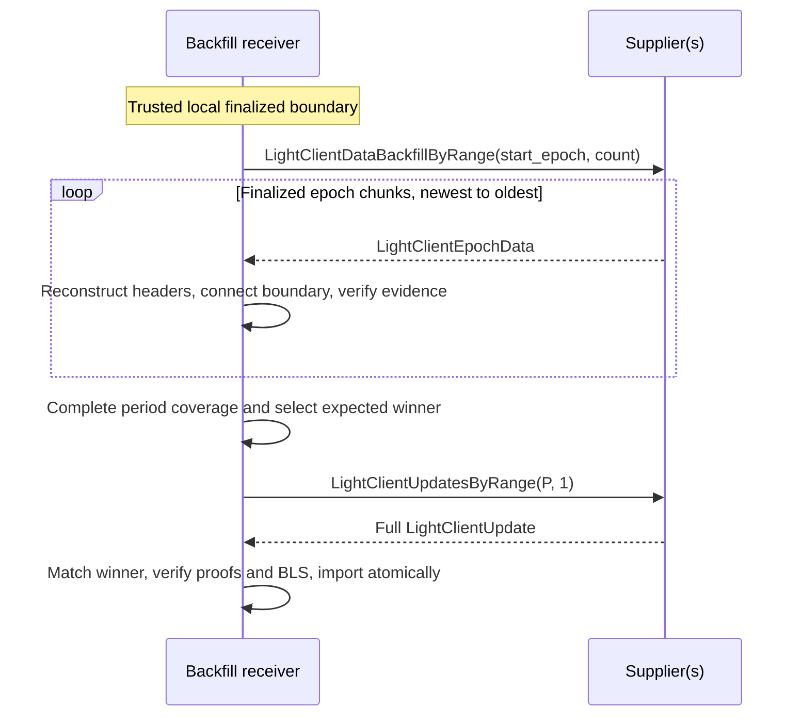

# Historical Light-Client (LC) Data Backfill in Prysm

Implement and evaluate an experimental historical light-client (LC) data backfill in Prysm, following the epoch-data protocol in Etan Kissling's [decentralized CL sync draft](https://hackmd.io/@etan-status/decentralized-cl-sync).

The receiver verifies finalized `LightClientEpochData` against its trusted local `LightClientStore`, reconstructs the canonical inputs needed to rank a completed period's candidates, and selects the best update itself. It then fetches that update through the standard `LightClientUpdatesByRange`. Only a matching, fully validated update is imported into Prysm's database and served through its existing LC REST API.

## Motivation

Ethereum consensus clients commonly start from a recent checkpoint instead of replaying the chain from genesis. This makes startup practical, but a checkpoint-synced node does not possess the historical post-states normally required to derive old light-client updates, including their sync-committee and finality proofs. Prysm's ordinary block backfill restores historical blocks, not those states, and it cannot restore them: a block cannot be undone to recover the state it was applied to, and states are not served over p2p. So if a completed period's update was never generated or has since been pruned, the updates-by-range interface cannot reconstruct it.

This matters beyond a single node. Historical LC data availability is one part of a decentralized checkpoint-sync pipeline: a freshly starting node walks LC updates until it authenticates a recent finalized `state_root`, downloads the corresponding `BeaconState` from an untrusted peer, and verifies that state against the authenticated root before initializing. The pipeline only works at scale if the nodes it asks can actually serve the historical updates it walks through — which is exactly what a checkpoint-synced Prysm node cannot do today.

### Roles

Two roles appear in this document and are kept distinct:

| Role                  | Responsibilities                                                                                                                                                                                                                                                                                         |
|-----------------------|----------------------------------------------------------------------------------------------------------------------------------------------------------------------------------------------------------------------------------------------------------------------------------------------------------|
| **Backfill receiver** | The node recovering its own history. Begins from a trusted local `LightClientStore`; requests epoch data; verifies coverage, reconstructed headers, and proofs; derives candidate-ranking inputs; selects the expected winner locally; obtains and validates the complete update; imports it atomically. |
| **Backfill supplier** | The untrusted party that supplies historical data. Collects and retains epoch data while the required blocks and states are available, and serves finalized `LightClientEpochData` and retained `LightClientUpdate` objects. The receiver does not trust its validity or best-update claims.             |

Epoch data and the complete update may come from different suppliers; correctness depends on verification, not on who supplied the data.

### The completeness problem

The central question is not only whether a supplied update is *valid* — it is whether it is the *best available*. `is_better_update` defines a total order over a period's candidates, so "the best update for period P" is a single value determined by the chain. Once a receiver holds it, no peer can supply a better one: the backfill for that period is provably finished, and every honest node converges on byte-identical data. Withholding is detectable as a consequence — the target is unique and computed locally, so a supplier who withholds the maximum produces a mismatch the receiver can see.

What makes completeness checkable rather than merely assumed is **chaining**. Each epoch record lets the receiver reconstruct a header for every non-empty slot, and each header commits to its parent's root. The receiver walks that chain backward from a header it already trusts, so the set of blocks that existed in the window is fixed by the hash chain rather than by the supplier's word. Ranking then needs no aggregate signatures: the blocks carrying the participation bits are proven canonical this way, and the chain's own state transition already verified their aggregates when it accepted them.

## Protocol flow

1. **Establish the trusted boundary.** Use the receiver's already synced `LightClientStore.finalized_header`, established as the latest canonical block at the requested window's end rather than merely a finalized ancestor.
2. **Request historical epoch data.** Call `LightClientDataBackfillByRange(start_epoch, count)` and walk backward through finalized history, up to 256 epoch records per request, streamed as individual chunks.
3. **Verify the history.** Reconstruct each non-empty block's body root and header, require the resulting chain to end at the authenticated boundary, and verify finality, execution, and committee evidence. The authenticated `parent_block_header` becomes the next older boundary.
4. **Select the expected winner locally.** Once the period's complete, aligned coverage is verified, derive all eligible candidates and reproduce Prysm's `IsBetterUpdate` comparison rules. `LightClientEpochData` is not a complete `LightClientUpdate`, so it cannot be passed directly to the unmodified function.
5. **Request the complete update.** Call the existing `LightClientUpdatesByRange(start_period=P, count=1)`. This returns the supplier's own selection, not all of its candidates.
6. **Match and validate.** Require the full update to match the locally selected winner's authenticated fields, then verify its fork-correct Merkle proofs and BLS aggregate signature against the authenticated committee for that historical period.
7. **Import and serve.** Atomically store the verified update, make equivalent reimports a no-op, reject conflicting records, and serve the result through Prysm's existing updates-by-range API.



One range request carries many epoch chunks; this is not one round trip per epoch. A short response, a missing winner, or a winner that does not match the local selection all mark the period incomplete and trigger a retry against a different supplier; after three suppliers the period is reported unavailable rather than failed. None of these is a protocol error — each signals an incomplete peer. A fully verified period with no eligible candidates is a separate outcome: no update is fabricated.

## Scope

A complete historical LC data backfill path in Prysm, disabled by default behind a debug flag:

- **Supplier.** Epoch data collected continuously during forward sync and retained for serving, plus the `LightClientDataBackfillByRange` responder.
- **Receiver and verifier.** Header reconstruction, complete canonical coverage, fork-correct proof validation, candidate derivation, independent `IsBetterUpdate` ranking, and full-winner matching.
- **Acquisition.** Epoch-data range requests, and full-update acquisition through the standard `LightClientUpdatesByRange`.
- **Import and serving.** Atomic verify-before-write import, `LightClientBootstrap` construction from the verified `bootstrap_data`, and round-trip serving through Prysm's existing LC REST endpoints.

A sync-committee period is the span of slots served by a single sync committee (256 epochs, or 8192 slots, on mainnet). It is the natural unit because the LC protocol retains one best `LightClientUpdate` per period. Recovering many periods is the same mechanism run longer, not a second one: the receiver walks records backward continuously and ranks each period as its coverage completes.

**Fork scope.** Backfill walks backward, so a node must decode every fork between its head and the oldest period it serves — not just the fork of the data it wants. Fork handling is therefore a schema table from day one rather than a later port: branch depths follow the applicable fork's SSZ layout, and the response context fork is taken from the last non-empty `block_data` entry. The table covers every fork from Electra forward, including Gloas. Gloas matters most because it is the fork whose `execution` field changes type — a block root after Gloas, an execution header before — so it is the case that proves the table works instead of merely varying a depth. Branch normalization is used only where the specification permits it; it never substitutes one fork's execution data type for another.

**What is demonstrated.** The end-to-end run is on a two-node mainnet-preset devnet with a fixed fork, plus a fork-transition fixture at the boundary. Mainnet preset is used throughout: no minimal-preset build, real 512-member committees, and real SSZ layouts, so measurements are mainnet numbers rather than projections. The cost is chain time — a completed period plus a boundary beyond it is just over 8192 slots — so the devnet shortens `SECONDS_PER_SLOT`, which is a config value rather than a preset one; at the standard slot time the same run is unattended and takes about a day. The checkpoint-receiver side of the pipeline — `BeaconState` transfer and checkpoint init — is a separate project.

### Supplier side

Epoch data is collected continuously during forward sync, not reconstructed afterwards. Every proof in `LightClientEpochData` is anchored to a block body root or a post-state root that the node already holds while processing that block, so a node that collects as it syncs never needs archive states. The supplier's exact contract is expected to settle during implementation.

## Trust model

The receiver needs one input it cannot derive itself: **a finalized header it already trusts**. In practice this is `LightClientStore.finalized_header`, obtained by the node's ordinary forward light-client sync from a trusted bootstrap root. Everything else is verified against it. All received records and updates are untrusted until verified, and the verifier never replays historical state transitions.

Each non-empty slot extends a parent-root chain. Removing a real block, inserting a fabricated one, or altering a header changes the reconstructed endpoint, so the window cannot connect to the authenticated boundary without breaking the hash assumptions. Each record's authenticated `parent_block_header` then becomes the boundary for the next older record. This addresses **completeness as well as validity**: the receiver ranks the complete authenticated candidate set instead of trusting a supplier's "best" label. What the protocol cannot do is force a supplier to answer or to retain data; unavailability is an operational problem, handled by retry, not a soundness problem.

**Alignment.** `EPOCHS_PER_SYNC_COMMITTEE_PERIOD` is 256 on mainnet and `MAX_REQUEST_LIGHT_CLIENT_EPOCH_DATA` is also 256, but that coincidence does not make a batch period-aligned: an arbitrary 256-record response straddles two periods unless `start_epoch` is chosen so that it does not. Ranking is defined per period, so the receiver must accumulate whole periods before selecting a winner. On mainnet the coincidence hides the mistake instead of exposing it: a "one request, one period" assumption passes on every aligned batch and fails only on a misaligned one, so a deliberately non-period-aligned `start_epoch` is a required fixture rather than an optional one. The verifier asserts alignment rather than assuming it.

## Specification

### Constants and range requests

| Name                                  | Mainnet |
|---------------------------------------|---------|
| `SLOTS_PER_EPOCH`                     | `32`    |
| `EPOCHS_PER_SYNC_COMMITTEE_PERIOD`    | `256`   |
| `SYNC_COMMITTEE_SIZE`                 | `512`   |
| `MAX_REQUEST_LIGHT_CLIENT_EPOCH_DATA` | `256`   |
| `MAX_REQUEST_LIGHT_CLIENT_UPDATES`    | `128`   |

| Method                           | Request                                 | Meaning of `count`                                      | Response bound                                     |
|----------------------------------|-----------------------------------------|---------------------------------------------------------|----------------------------------------------------|
| `LightClientDataBackfillByRange` | `start_epoch: Epoch`, `count: uint64`   | Maximum epoch records, from the highest requested epoch | `MAX_REQUEST_LIGHT_CLIENT_EPOCH_DATA = 256`        |
| `LightClientUpdatesByRange`      | `start_period: uint64`, `count: uint64` | Period range `[start_period, start_period + count)`     | At most `min(count, 128)`; one per returned period |

The proposed epoch-data protocol ID is `/eth2/beacon_chain/req/light_client_data_backfill_by_range/0/`, serving finalized data only. The existing update protocol is `/eth2/beacon_chain/req/light_client_updates_by_range/1/`. Neither request guarantees that a supplier retains all requested history. Proof depths are computed per fork from the applicable SSZ layout and pinned as generated constants.

### `LightClientBlockData`

```python
class SyncAggregateBranch(
    Vector[Bytes32, floorlog2(
        get_generalized_index(BeaconBlockBody, "sync_aggregate"))]
):
    pass #TBD

class LightClientBlockData(Container):
    proposer_index: uint64
    state_root: Root
    sync_committee_bits: Bitvector[SYNC_COMMITTEE_SIZE]
    sync_committee_signature_root: Root
    sync_aggregate_branch: SyncAggregateBranch
```

The slot is derived from the entry's position, and `parent_root` from the preceding reconstructed header; `proposer_index` and `state_root` are the two header fields not otherwise recoverable. The receiver combines the SSZ root of `sync_committee_bits` with `sync_committee_signature_root` to obtain the `SyncAggregate` root, then folds `sync_aggregate_branch` to reconstruct `body_root`. `sync_committee_signature_root` supports reconstruction and later signature matching.

### `LightClientBootstrapData`

The full committee is present only for the last checkpoint in a fully finalized period; other checkpoints still carry its branch. The execution field is a block root after Gloas and an execution header before Gloas, so its type and proof path are fork-specific.

```python
class LightClientBootstrapData(Container):
    current_sync_committee: List[SyncCommittee, 1]
    current_sync_committee_branch: CurrentSyncCommitteeBranch

    execution_block_hash: Root  # `execution` header, before Gloas
    execution_branch: ExecutionBranch
```

### `LightClientEpochData`

```python
class FinalizedCheckpointBranch(
    Vector[Bytes32, floorlog2(
        get_generalized_index(BeaconState, "finalized_checkpoint"))]
):
    pass #TBD

class LightClientEpochData(Container):
    epoch: Epoch
    parent_block_header: BeaconBlockHeader
    block_data: Vector[LightClientBlockData, SLOTS_PER_EPOCH]

    bootstrap_data: LightClientBootstrapData

    finalized_checkpoint: Checkpoint
    finalized_checkpoint_branch: FinalizedCheckpointBranch
```

For record `E`, index `i` represents slot `compute_start_slot_at_epoch(E - 1) + 1 + i`. The vector therefore covers the slots **after the previous epoch boundary through the current boundary**, inclusive.

- `parent_block_header` — the latest block at or before the previous boundary. Once authenticated, it is the boundary for the next older record.
- A missed slot is exactly `default(LightClientBlockData)` and does not advance the reconstructed header root. A supplier can neither suppress nor fabricate a block, because either breaks the chain at the next non-empty entry. Missed slots create no additional block headers, which matters for ranking: a checkpoint in a new epoch or period can point to the last real block of an older one.
- `finalized_checkpoint` / `finalized_checkpoint_branch` — finality evidence belonging to the first non-empty entry's state; for an all-empty vector, to `parent_block_header.state_root`. Unlike the standard update's `finality_branch`, this proves the **whole** `Checkpoint`: epoch and root.
- `bootstrap_data` — belongs to the last non-empty entry, the checkpoint block for that window. Its `current_sync_committee` is supplied only for the last checkpoint in a fully finalized period; other checkpoints still carry the branch.
- The last non-empty entry is by definition the latest block at or before the boundary, so a missed boundary slot needs no special case and a window can never hold two checkpoint blocks. An all-empty window advances no header, contributes no candidates, carries default `bootstrap_data`, and anchors its finality evidence to `parent_block_header.state_root`.

### Proofs and verification targets

| Evidence                                                               | Verification target                                                                                  |
|------------------------------------------------------------------------|------------------------------------------------------------------------------------------------------|
| Bits, signature root, and `sync_aggregate_branch`                      | Reconstructed `body_root`, then the header chain's authenticated endpoint                            |
| `finalized_checkpoint` and its branch                                  | First non-empty block's authenticated `state_root`, or the parent state root for an all-empty vector |
| `bootstrap_data.execution_block_hash` and `execution_branch`           | Last non-empty block's authenticated `body_root`                                                     |
| `bootstrap_data.current_sync_committee` and its branch                 | Corresponding checkpoint block's authenticated `state_root`                                          |
| Full update's finality/next-committee branches and aggregate signature | Its `attested_header` and the authenticated historical signing committee                             |

Branch lengths and proof paths follow the applicable fork. The draft's **response context fork** is determined by the last non-empty `block_data` entry, or by `epoch` if all entries are empty. Each chunk is decoded independently.

### Deriving `is_better_update` inputs

A candidate is a possible standard `LightClientUpdate`, not a separate wire object. A canonical block supplies the sync aggregate and `signature_slot`; its parent supplies the `attested_header`. Under the [standard full-node collection rules](https://github.com/ethereum/consensus-specs/blob/master/specs/altair/light-client/full-node.md#create_light_client_update), eligible candidates have a post-Altair parent, meet the minimum participation requirement, and have attested and signature slots in the same period.

| Input                         | Derivation                                                                                                                                                                      |
|-------------------------------|---------------------------------------------------------------------------------------------------------------------------------------------------------------------------------|
| `max_active_participants`     | `SYNC_COMMITTEE_SIZE` from the preset.                                                                                                                                          |
| `num_active_participants`     | Population count of the entry's `sync_committee_bits`.                                                                                                                          |
| `signature_slot`              | `s`, from the entry's index within `block_data` and the record's `epoch`.                                                                                                       |
| `attested_header`             | The preceding reconstructed non-empty header — the most recent ancestor the aggregate attests to, not necessarily at `s-1`.                                                     |
| `has_relevant_sync_committee` | `period(attested_slot) == period(s)`, computed from slots.                                                                                                                      |
| `has_finality`                | `finalized_checkpoint.epoch != GENESIS_EPOCH` for the window holding the attested header — the condition under which `create_light_client_update` populates `finalized_header`. |
| `has_sync_committee_finality` | `finalized_checkpoint.root in reconstructed_block_roots(period(attested))`.                                                                                                     |
| Final tiebreakers             | Larger `num_active_participants`, then smaller `attested_slot`, then smaller `signature_slot`.                                                                                  |

One proven `Checkpoint` per record is enough for every candidate in it. `finalized_checkpoint` is written during epoch processing, so every block in an epoch carries the same value in its post-state; the record's proof is therefore the finality evidence for every candidate whose attested header lies in that window. When a candidate's attested block is the last non-empty entry of the previous window, its evidence comes from that record instead.

During the epoch-data phase the receiver does not yet have `finalized_header.beacon.slot`, but the same-period comparison does not need its exact value. For a candidate whose attested header is in period `P`, the receiver builds the set of authenticated roots of actual, non-empty headers reconstructed in `P` and checks membership. If the root belongs to that set, the finalized and attested headers are in the same period; otherwise the finalized header belongs to an older one. The receiver must **not** infer this from `finalized_checkpoint.epoch`.

After `LightClientUpdatesByRange(P, 1)` returns the winner, the exact slot comes from `update.finalized_header.beacon.slot`, and the receiver runs the standard full-update checks using the actual header, branches, and aggregate signature. It must not invent a slot or construct a placeholder update merely to call the unmodified `IsBetterUpdate`. Equivalence to `IsBetterUpdate` holds by construction over these inputs, and is validated by differential testing against Prysm's live LC collection path.

## Verifier requirements

The core verifier is deterministic and separate from networking and database writes. It must:

1. Enforce SSZ, list, and branch bounds, supported fork schemas, request alignment, and contiguous backward coverage before any cryptographic work; stop at the configured lower bound, never before Altair.
2. Reconstruct headers and missed slots, and connect every epoch window to an authenticated boundary.
3. Verify all required finality, execution, and committee evidence, and committee period ownership, before accepting a period as complete.
4. Derive the complete eligible candidate set and reproduce Prysm's `IsBetterUpdate` rules without fabricating incomplete `LightClientUpdate` objects.
5. Match the fetched update against the locally selected winner — attested header, signature slot, participation bits, expected finality and committee facts, and `hash_tree_root(sync_committee_signature)` — then validate its full proofs and BLS signature.
6. Never import a signature-root-only or ranking-only object, and never feed a historical update into the current forward-sync store as though it were new.

Only a fully verified update is written, atomically. An equivalent existing record is a no-op; a conflicting one follows a non-overwrite policy and surfaces an error. Invalid, missing, or contradictory evidence returns an error without importing the affected period.

## Roadmap

Twelve weeks, phases non-overlapping. Phase 0 is already under way: reading the draft, mapping it onto Prysm, and specifying the contract above is the work that produced this proposal. Eight weeks remain for implementation and evaluation.

| Phase                            | Weeks           | Deliverables                                                                                                                                                                                                                                      |
|----------------------------------|-----------------|---------------------------------------------------------------------------------------------------------------------------------------------------------------------------------------------------------------------------------------------------|
| **0 — Protocol contract**        | 1–4 (under way) | The epoch-data contract specified above: containers and proof paths, candidate evidence mapping, boundary and empty-window rules, fork scope, retry policy, generated proof-depth constants, documented security assumptions. Reviewed with Etan. |
| **1 — Epoch data and supplier**  | 5–6             | Fork-aware containers, deterministic supplier-side collection, and mainnet-preset positive fixtures.                                                                                                                                              |
| **2 — Verification and ranking** | 7–9             | Header-chain verification, complete coverage, evidence checks, candidate derivation, and agreement with Prysm's live LC selection.                                                                                                                |
| **3 — Prysm integration**        | 10–11           | Epoch-data range exchange between two nodes, full-update acquisition, winner matching, historical proof and BLS validation, atomic import, `LightClientBootstrap` construction, and REST round trip.                                              |
| **4 — Evaluation and review**    | 12              | Adversarial and boundary fixtures, measurements, and mentor review.                                                                                                                                                                               |

There is no separate buffer week. Phase 4 is the compressible one: if earlier phases slip, evaluation narrows to the devnet end-to-end run and the adversarial suite, and integration ships as a draft PR.

## Possible challenges

1. **The design is not a ratified specification.** The draft may move, and its author marks the specification section itself as provisional. This proposal pins its own interpretation wherever the draft leaves room, so drift lands on the containers and proof paths rather than on the verifier's logic — coverage, ranking, matching, and import are unaffected by a change in field layout. Interpretation questions found while writing the contract go back to the draft during Phase 0.
2. **Completeness is structural; eligibility is not.** The reconstructed header chain fixes which blocks existed, which is the part that would otherwise rest on trust. What it does not fix is the filtering: each candidate must be matched to the right finality evidence and to the spec's collection rules. The evidence for a candidate belongs to the record whose window carries its attested block's epoch, and the epoch-boundary slot is the case where that is not the obvious record — an off-by-one there silently flips `has_finality` and can change the winner without any proof failing. Mitigation: differential testing against Prysm's live LC selection, plus explicit fixtures for missed boundary slots and epoch and period transitions.
3. **Winner mismatch is expected, not exceptional.** `LightClientUpdatesByRange` returns the supplier's own selection rather than a named update, so a supplier with incomplete history can return an update that does not match the locally computed winner. Honest suppliers that collected data continuously converge on the same winner, so a mismatch signals an incomplete supplier. The retry policy must say so rather than treat it as a protocol error.
4. **The supply side has to be bootstrapped.** Epoch data can be verified but not conjured. The state-anchored evidence — `finalized_checkpoint` and `current_sync_committee` with their branches — requires the post-state as it existed when the block was processed, and a block cannot be undone to recover it. A node that only backfilled blocks therefore cannot regenerate epoch data for periods it never processed. Historical data originates from suppliers that sync forward with collection enabled, then spreads from suppliers to receivers. Mitigation: the demonstration devnet creates it by construction; the retention footprint is measured rather than assumed, and retaining a per-node subset of older data is the available lever if the full history is too large to keep everywhere.
5. **Phase 3 is the schedule risk, and mainnet preset adds chain time to it.** Two-node exchange, winner matching, historical proof and BLS validation, import, bootstrap construction, and REST round trip all land in two weeks, and a completed period plus a boundary beyond it is just over 8192 slots of devnet time. Mitigation: the devnet is started early and runs unattended with a compressed `SECONDS_PER_SLOT`, and the transport can fall back to SSZ fixtures or an in-process adapter without weakening any claim, since the data is self-verifying and transport-neutral, and bootstrap construction is assembly of already-verified fields rather than new proof work.

## Success criteria

- Backfill of at least one complete mainnet-preset sync-committee period — 256 epochs, 8192 slots — from an explicit trusted LC boundary, with no trust in the supplier's winner selection.
- The verifier reconstructs the complete canonical candidate set and selects the same winner as Prysm's live LC collection on supported fixtures, including missed slots, finality changes, and fork boundaries.
- Every adversarial fixture — forged skips, omitted candidates, altered proofs, wrong committees, mismatched updates, incomplete periods, oversized and reordered inputs — is rejected with zero database mutations.
- A verified missing update is fetched, matched, fully validated, and imported atomically; equivalent and conflicting existing records follow the defined non-overwrite behaviour.
- Prysm's existing updates-by-range REST endpoint returns the imported update byte-identically, and a `LightClientBootstrap` built from verified `bootstrap_data` is served through the existing bootstrap endpoint.
- Encoded epoch-data sizes, verification wall-clock time, and peak memory are measured and reported on the mainnet preset directly, with no projection step.

State snapshot sync and the checkpoint-receiver side of the pipeline are separate projects.

## Collaborators

**Fellow:** Jeff Chung ([jeffoodchain](https://github.com/jeffoodchain))

**Mentors:** Etan Kissling ([etan-status](https://github.com/etan-status)), Nimbus; Bastin ([Inspector-Butters](https://github.com/Inspector-Butters)), Prysm.

## Resources

- [Decentralized CL sync draft](https://hackmd.io/@etan-status/decentralized-cl-sync) — the design this project implements. Provides the container shapes, the epoch-data range protocol, and the rollout model.
- [Nimbus PR #8445](https://github.com/status-im/nimbus-eth2/pull/8445) — an earlier, period-granular formulation of the same goal, anchored on `HistoricalSummary` and a committed `block_roots` list. Superseded for this project by the epoch-data draft, which needs no archive states on the supplier side.
- [consensus-specs #3553](https://github.com/ethereum/consensus-specs/pull/3553) — canonical-only LC data collection. Establishes the canonicality requirement this verifier enforces.
- [consensus-specs #3614](https://github.com/ethereum/consensus-specs/pull/3614) — tracking the best `SyncAggregate` in `BeaconState`; the spec-side counterpart that would remove the need to transfer per-slot ranking inputs at all.
- [EIP-7658](https://eips.ethereum.org/EIPS/eip-7658) — the EIP formulation of the same direction as #3614; currently Stagnant. This project follows the epoch-data model instead, which requires no fork.
- [Altair light-client sync protocol](https://github.com/ethereum/consensus-specs/blob/master/specs/altair/light-client/sync-protocol.md) — validation and `is_better_update`.
- [Altair light-client full-node data collection](https://github.com/ethereum/consensus-specs/blob/master/specs/altair/light-client/full-node.md) — update construction and eligibility.
- [Altair light-client P2P interface](https://github.com/ethereum/consensus-specs/blob/master/specs/altair/light-client/p2p-interface.md) — the existing `LightClientUpdatesByRange` method.
- [Gloas light-client specifications](https://github.com/ethereum/consensus-specs/tree/master/specs/gloas/light-client) — fork-specific execution and bootstrap proof shapes.
- [Prysm repository](https://github.com/OffchainLabs/prysm)
- [EPF Cohort 7 project idea: decentralized consensus-layer checkpoint sync](https://github.com/eth-protocol-fellows/cohort-seven)
- [EPF Cohort 5 project: Light Client Server Support in Prysm](https://github.com/eth-protocol-fellows/cohort-five)

