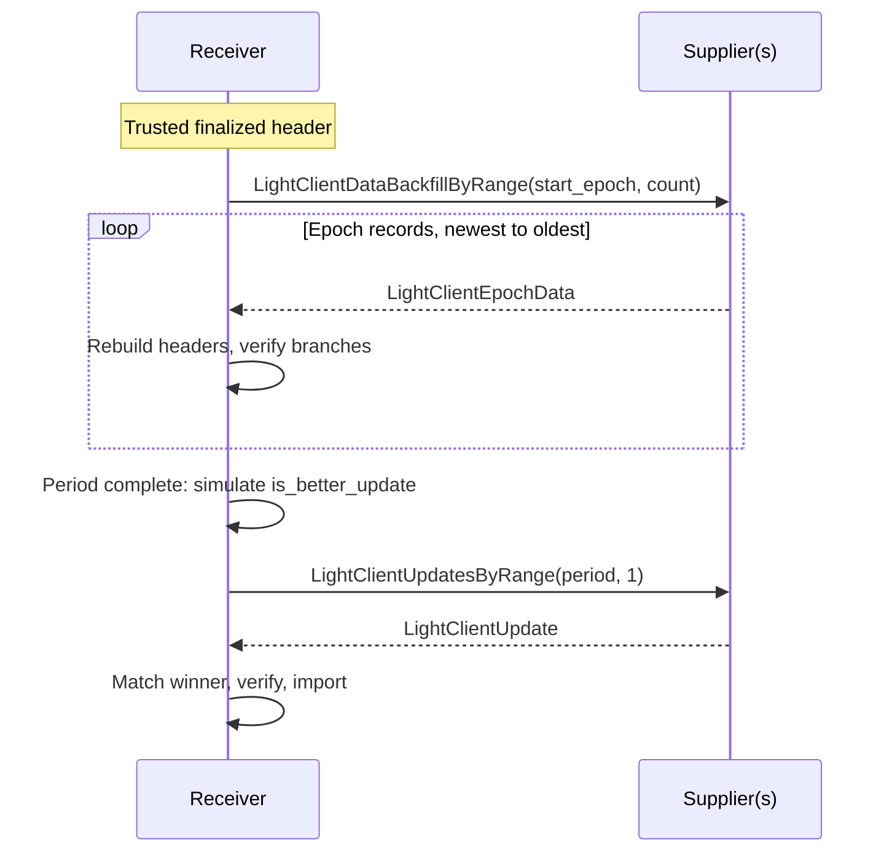

# Historical Light-Client (LC) Data Backfill in Prysm

Implement an experimental light-client (LC) data backfill in Prysm, based on the LC data backfill section of Etan Kissling's [decentralized CL sync draft](https://hackmd.io/@etan-status/decentralized-cl-sync).

## Motivation

Most consensus clients start from a recent checkpoint instead of syncing from genesis. A checkpoint-synced node does not have the historical states it needs to build old `LightClientUpdate`s. Prysm's block backfill restores blocks, not states, so the node cannot serve LC updates for periods before its checkpoint.

This limits decentralized checkpoint sync. A new node walks LC updates forward to reach a recent finalized header, so the network needs nodes that can serve that history.

## Project description

The draft's idea: sync from a trusted root, then backfill epoch by epoch from `compute_epoch_at_slot(store.finalized_header.slot)`, verify every field, and simulate `is_better_update`.

There are two roles:

- **Supplier:** an untrusted node that collects `LightClientEpochData` during forward sync and serves it.
- **Receiver:** the node recovering history. It trusts only its own finalized header and verifies everything it receives.

### Flow

1. **Start from a trusted header.** Use `LightClientStore.finalized_header`, or a full node's own finalized header.
2. **Request epoch data.** Call `LightClientDataBackfillByRange(start_epoch, count)` and walk backward. 
3. **Verify.** Rebuild block headers from `block_data`, check that the parent-root chain ends at the trusted header. The verified `parent_block_header` becomes the trusted header for the next older record.
4. **Select the best update locally.** Once a whole sync-committee period is verified, simulate `is_better_update` over its candidates.
5. **Fetch the full update.** Call the existing `LightClientUpdatesByRange(start_period, 1)`. Prysm needs client-side support for this request.
6. **Match and validate.** Check that the update matches the local winner, verify its proofs, and check that `hash_tree_root(sync_committee_signature)` equals the verified `sync_committee_signature_root`.
7. **Import and serve.** Store the update atomically and serve it through Prysm's existing LC REST API.



If a response is short, or the returned update does not match the local winner, the receiver marks the period incomplete and retries with other suppliers in the background.

## Specification

### Containers (from the draft)

```python
class LightClientBlockData(Container):
    proposer_index: uint64
    state_root: Root
    sync_committee_bits: Bitvector[SYNC_COMMITTEE_SIZE]
    sync_committee_signature_root: Root
    sync_aggregate_branch: SyncAggregateBranch

class LightClientBootstrapData(Container):
    current_sync_committee: List[SyncCommittee, 1]
    current_sync_committee_branch: CurrentSyncCommitteeBranch
    execution_block_hash: Root  # `execution` header, before Gloas
    execution_branch: ExecutionBranch

class LightClientEpochData(Container):
    epoch: Epoch
    parent_block_header: BeaconBlockHeader
    block_data: Vector[LightClientBlockData, SLOTS_PER_EPOCH]
    bootstrap_data: LightClientBootstrapData
    finalized_root: Root
    finality_branch: FinalityBranch
```

- `parent_block_header`: the latest block at `compute_start_slot_at_epoch(epoch - 1)`. It can come from an earlier epoch if that slot was missed.
- `block_data`: one entry per slot, from `compute_start_slot_at_epoch(epoch - 1) + 1` through `compute_start_slot_at_epoch(epoch)`. Empty slots are `default(LightClientBlockData)`.
- `bootstrap_data`: extra data for the last non-empty `block_data[i]` (the `Checkpoint` block), used to form a `LightClientBootstrap`. The full `current_sync_committee` is present only for the last checkpoint in a period, once that period is fully finalized.
- `finalized_root` and `finality_branch`: the `finalized_checkpoint.root` of the first block within `epoch - 1` among `parent_block_header` and `block_data`.
- The draft defines special cases for `epoch == ALTAIR_FORK_EPOCH`. Epoch data can be produced down to that epoch.

### Networking (from the draft)

`/eth2/beacon_chain/req/light_client_data_backfill_by_range/0/`

- Request: `start_epoch: Epoch` (highest epoch to start from) and `count: uint64` (maximum number of records).
- Response: `List[LightClientEpochData, MAX_REQUEST_LIGHT_CLIENT_EPOCH_DATA]`, with `MAX_REQUEST_LIGHT_CLIENT_EPOCH_DATA = 256`.
- Only finalized data can be requested.
- The response context fork comes from the last non-empty `block_data[i]`. If all entries are empty, it comes from `epoch`.
- Rate limits, request cost, and response size bounds are still TBD in the draft.

### Prysm implementation

- **Supplier:** collect epoch data during forward sync, while the blocks and states are still available, and serve the range request. For the rest of the data, a supplier starts from genesis state and run state transition function for each block and store the data in the meanwhile.
- **Receiver:** request epoch data, verify it, simulate `is_better_update` per period, then fetch, match, and import the full update.
- **Serving:** return imported updates through the existing LC REST endpoints.

## Roadmap

| Phase                            | Weeks           | Deliverables                                                                    |
|----------------------------------|-----------------|---------------------------------------------------------------------------------|
| **0 — Protocol mapping**         | 1–4 (under way) | Map the draft onto Prysm and review open questions with Etan.                   |
| **1 — Epoch data and supplier**  | 5–6             | Containers, supplier-side collection, and test fixtures.                        |
| **2 — Verification and ranking** | 7–9             | Header-chain verification, branch checks, and `is_better_update` simulation.    |
| **3 — Prysm integration**        | 10–11           | Range exchange between two nodes, full-update fetch and matching, import, REST. |
| **4 — Evaluation and review**    | 12              | Adversarial fixtures, measurements, and mentor review.                          |

If earlier phases slip, Phase 4 narrows to a devnet end-to-end run, and the integration ships as a draft PR.

## Possible challenges

1. Container layouts may change during implementing. Keeping the verifier separate from the wire format limits the impact.
2. **Edge cases in ranking.** Missed slots, epoch boundaries, and period boundaries can change which update wins without any proof failing. Differential tests against Prysm's live LC collection will catch this.
3. **Epoch data must be collected during forward sync.** A node that only backfilled blocks cannot produce it later, because it never had the states.
4. **Devnet time.** One full period is 8192 slots on the mainnet preset. The devnet shortens the slot time so the test fits in the schedule.

## Goal of the project

- Backfill at least one complete mainnet-preset sync-committee period from a trusted LC header, without trusting the supplier's choice of best update.
- Select the same winner as Prysm's live LC collection on test fixtures.
- Reject invalid or incomplete data without writing anything to the database.
- Serve the imported update through Prysm's existing LC REST API.

## Collaborators

### Fellows

Jeff Chung ([jeffoodchain](https://github.com/jeffoodchain))

### Mentors

- Etan Kissling ([etan-status](https://github.com/etan-status)), Nimbus
- Bastin ([Inspector-Butters](https://github.com/Inspector-Butters)), Prysm

## Resources

- [Decentralized CL sync draft](https://hackmd.io/@etan-status/decentralized-cl-sync)
- [Nimbus PRs labelled `lc-backfill`](https://github.com/status-im/nimbus-eth2/pulls?q=label%3Alc-backfill)
- [consensus-specs #3553: Restrict best LC update collection to canonical blocks](https://github.com/ethereum/consensus-specs/pull/3553)
- [consensus-specs #3614: Enable light client data backfill by tracking best `SyncAggregate`](https://github.com/ethereum/consensus-specs/pull/3614)
- [EIP-7658: Light client data backfill](https://eips.ethereum.org/EIPS/eip-7658)
- [Altair light-client sync protocol](https://github.com/ethereum/consensus-specs/blob/master/specs/altair/light-client/sync-protocol.md)
- [Altair light-client full-node data collection](https://github.com/ethereum/consensus-specs/blob/master/specs/altair/light-client/full-node.md)
- [Altair light-client P2P interface](https://github.com/ethereum/consensus-specs/blob/master/specs/altair/light-client/p2p-interface.md)
- [Prysm repository](https://github.com/OffchainLabs/prysm)
