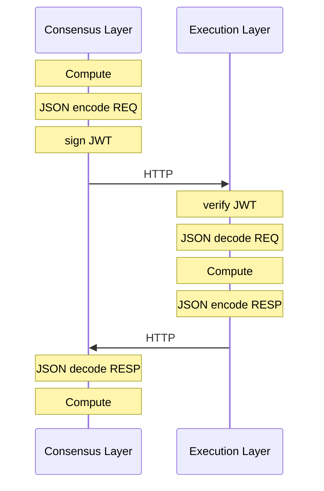
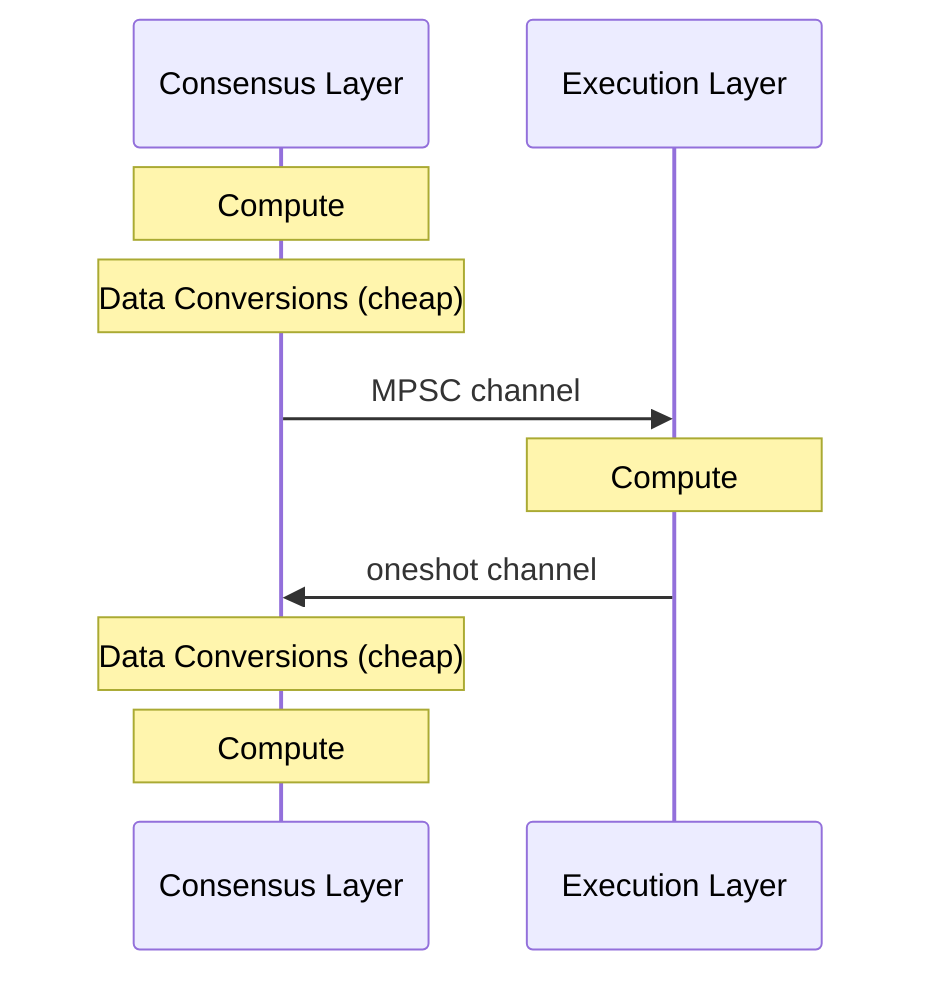

# Ream: Execution Layer Integration for the Lean Chain

Embed Reth directly into the Ream binary, as a library so that the full CL+EL combination can be driven within one process, avoiding HTTP bridge that introduces inefficiencies such as bad UX and JSON encode-decode in communication.

## Motivation

After 7-8 years of R&D development, the "Merge" upgrade, i.e. first step of the end game shipped on September 15, 2022.

### The good

The "Merge" upgrade brought a lot of benefits instantly like drop in energy usage, better security economics, finality and much more.

### The bad

Before the "Merge" upgrade, running an Ethereum node that syncs mainnet was simply running a binary with some flags. Post upgrade, running a node means running two binaries with the JWT auth setup. 

For staking validator nodes (or the pre-merge mining nodes) the setup steps were anyway a lot, so it doesn't matter if you have to run two binaries or four. But for hobbyist that want to manually run a non-validating Ethereum node, unexpectedly more steps involved.

### The ugly

This CL <> EL communication involves a lot of steps. It mostly works apart from the JSON encode-decode that costs a considerable CPU time (up to 1s), eating into slot time budget. 

### Public reactions

Many folks have been vocal about this:

> "We can verify ethereum with a single binary and deprecate the engine API" -- [Alex Stokes | EF](https://x.com/ralexstokes/status/1748779711394677041)

> "The Merge introduced insane complexity not only for UX of running a node, but also for testing and debugging the protocol" -- [Andrei | Ipsilon](https://x.com/gumb00/status/2033494724795879570?s=20)

> "JSON is a the most significant bottleneck there (up to 1s on geth of overhead)" -- [Giulio | Erigon](https://x.com/GiulioRebuffo/status/2047816897031217616?s=20)

> "EngineAPI was the worst possible glue regarding complexity and performance (JSON-RPC for private communication, seriously?)" -- [Hai | RISE](https://x.com/hai_rise/status/2033522025642524854?s=20)

> "Running two daemons and getting them to talk to each other is far more difficult than running one daemon" -- [Vitalik | EF](https://x.com/VitalikButerin/status/2033016131884376541?s=20)

### Potential solutions considered by the community

#### Swap JSON into SSZ format

SSZ encode-decode is way more efficient than JSON. And there is active effort for replacing the JSON format into SSZ. This approach enables existing staking infra to simply upgrade the familiar EL and CL binaries that uses SSZ with minimal change in their routine. There are some EPF7 projects already exploring this.  

#### Have EL and CL in same binary

This approach removes a lot of complexity introduced by the two binary architecture.
- Skipping JSON/SSZ encode, JWT auth, HTTP since CL and EL live in the same process sharing memory causing the engine API calls to use minimal memory ops and hence minimum latency. 
- Running an Ethereum node can be as simple as `client-bin --network mainnet` in the terminal. 

This EPF project focuses on this solution. 

## Project description 

This project will integrate Reth into Ream's Lean Chain as a library. Ream and Reth will use the same tokio runtime that manages async tasks across multiple threads as well as will share the same memory. Both Ream and Reth also share the same Ethereum data type foundation i.e. `alloy-primitives` for `U256`, `Address`, `Bytes`, hence conversions between Ream and Reth data types would have a lower overhead.

The CL <> EL communication is simplified. The Data Conversions and MPSC/oneshot channel overheads are negligible.

This should allow running a lean chain devnet that allows to accept transactions from external wallets into mempool, so that a proposer can include in their block and confirm the transaction. We also want to interop with other clients like EthLambda.

Once basic functionality is implemented, this project aims to stress test and see the performance effects on consensus activities when Reth shares the tokio runtime. The results of this exploration can motivate further explorations to reduce the bad effects / latency optimisations. 

## Specification

The execution layer integration is an effort that is not part of the currently running lean's devnet5, hence it is to be implemented under a rust feature flag.

### Reth

The `reth-ethereum` library crate has a [`NodeBuilder`](https://github.com/paradigmxyz/reth/blob/7d74e65f802ef49ed8737b9165d14f8f4cad4920/crates/node/builder/src/builder/mod.rs#L153) to start Reth and provide an optional tokio runtime handle.

The `NodeBuilder` gives a `Node`, that is to be owned by the binary's `main` function. And cheaply clonable already existing MPSC transmitter handles `PayloadBuilderHandle` and `ConsensusEngineHandle` in the Reth `Node` can be extracted and passed to the lean chain service, where it can directly call the required functionality on Reth.

The Reth `Node`'s `exit_future` should be handled, for the case the node crashes. The `Node` does not need to be explicitly stopped, it stops when the variable is dropped i.e. the `main` function returns.

Disable Type-3 transactions to start with, until PeerDAS is supported in Lean chain. 

### Lean

Currently the LeanSpecs's `BlockBody` just contains `attestations`, no execution block details yet. We will add `ExecutionPayloadV4` in the lean block body. 

These methods in the lean chain service needs to handle this:
- `handle_produce_block`: produces a Lean block, needs to first call `engine_getPayload` to secure an EL payload to include in the Lean block body.
- `Store::on_block`: imports lean block during live import or syncing, needs to verify the EL payloads.
- Call fork choice updated when building EL payload as well as importing blocks.

#### Block Propose

Build the EL payload inside `handle_produce_block` to include it in the Lean block body. Also call fork choice updated.

#### Block Import 

Handle the `on_block` to verify the EL payload and call fork choice updated.

## Roadmap

### Week 0-4: Prior work

- [Deep Dive](https://hackmd.io/@Ayhm2-FHQhSLkoc1OEcr9g/BkgIVxNV-Ge).
- [High Level Plan](https://hackmd.io/Z3km32ovRAiAdS6X9yzsKw).
- [Tracking Issue](https://github.com/ReamLabs/ream/issues/1470).
- Prototype draft PR ([ream#1472](https://github.com/ReamLabs/ream/pull/1472)).
- Scaffold a `ream-reth` crate inside the `ream` workspace for utils.
- Use `NodeBuilder` to bootstrap a Reth instance and integrate in binary.
- Pass the reth handle to the lean chain service.
- Integrate into methods like `handle_produce_block` and `on_block` to call the reth engine API.

### Week 5: Proposal and Scope

- Finalize the proposal.

### Week 6-8: Initial prototype

- Harden the prototype with testing.
- Have the initial prototype reviewed.

### Week 9-10: Devnet + wallet demo

- Local devnet that produces blocks with transactions.
- Wallet -> mempool -> block -> tx finalised flow for type-2 tx.

### Week 11-12: Benchmarking

- Benchmark report: Response times, CPU, Memory usage for CL-EL communication, validator duties with and without EL integration.

### Week 13-16: Interop + Stress

- Interop with EthLambda and other lean clients integrating EL. 
- Stress testing with various topologies and payload types (small, maximized gas, maximized byte size).

### Week 17+: Stretch goals

- Blobs/PeerDAS integration to support type-3 transactions on the EL layer.
- Writeup blog post to share the findings from this effort.

## Possible challenges

### Shared tokio-runtime contention

Reth's EVM execution and Ream's heavy PQ signature work can overlap during block production and import. When they share the same tokio runtime, there can be a competition for the CPU, and it might cause delay in validator duties.

### Lean slot budget

Lean targets a 4 second slot, with 3-slot finality. There are 5 intervals and each interval is allocated 800ms. It is a tight budget to fit.

## Goal of the project

### Base success

- Simple CLI command `ream lean_node` boots the CL with embedded EL in one process.
- Ream devnet with Reth integrated that can finalise type-2 transactions. 

### Strong success

- Interop with other lean clients supporting EL e.g. EthLambda to run long running devnets.
- Benchmark report quantifying latency and delays in validator duties under defined load.
- Ream devnet supporting type-3 transactions.

## Collaborators

### Fellows

- Sahil Gill ([@Sahilgill24](https://github.com/Sahilgill24/))
- Soham Zemse ([@zemse](https://github.com/zemse))

### Mentors

- Kolby ML  ([@KolbyML](https://github.com/KolbyML))
- Shariq Naiyer ([@shariqnaiyer](https://github.com/shariqnaiyer))

## Resources

- [Ream client](https://github.com/ReamLabs/ream) (tracking issue [#1470](https://github.com/ReamLabs/ream/issues/1470)).
- [Fullhouse](https://blog.sigmaprime.io/fullhouse.html) by SigmaPrime.
- [Nimbus Unified Client](https://blog.nimbus.team/the-nimbus-unified-client/).
- [EthLambda Execution Payload](https://github.com/lambdaclass/ethlambda/blob/344c67b8b7c61e15b1cfd71cfc75769f454d9d6a/docs/plans/lean-execution-payload-schema.md#blockbody).
